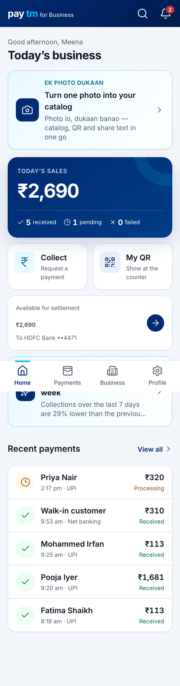
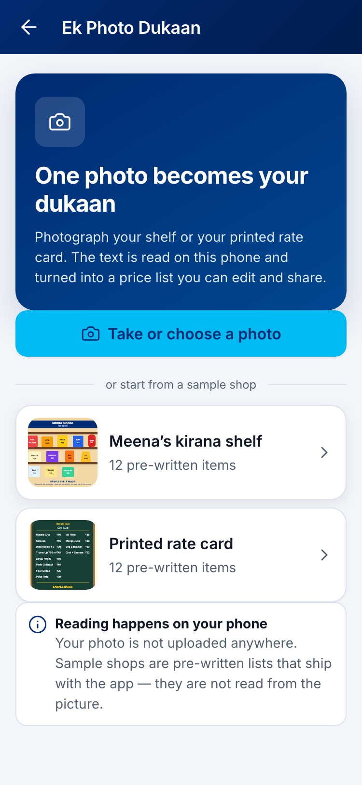
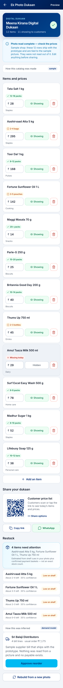
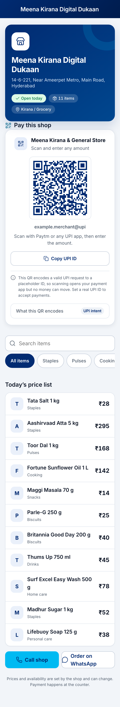

# Demo walkthrough

**Unofficial prototype** — simulated payments and labelled demo fixtures. Not official Paytm.

Phone-width browser (DevTools responsive, ~390px) looks like the merchant app. Use `http://localhost:5173` after `npm run dev` from `merchant-app/`, or the production Vercel URL.

The hero path is **one photo → digital dukaan**. Merchant payments are the existing shell and the signal source, not the opening pitch.

For the 5-minute judged run, use [SPEAKER_SCRIPT.md](./SPEAKER_SCRIPT.md). It is the timed version of this file with the words to say. This document is the fuller walkthrough and the reference for what each screen actually does.

Every screen below is captured in [`screens/`](./screens/). `journey-01-empty-dukaan.png` through `journey-14-qr.png` are this walkthrough in order, so you can confirm what a beat should look like without running the app.

<p align="center">
  
  
  
  
</p>

---

## Pick the right sample

Four samples ship with the app, in two groups that make **opposite** claims. Say which group you are in, every time.

**Group 1 — sample shops (FIXTURE).** Drawings, with rows we wrote. Nothing is read from the picture. Fast and identical every run, which is why the judged path lives here.

| Sample | Use it for | Why |
| --- | --- | --- |
| **Meena's kirana shelf** | **The judged run.** | ₹45 has exactly **one** basket on this catalog: 1× Thums Up 750 ml, 14 combinations searched, 92% confidence. The attribution beat is unambiguous. |
| **Printed rate card** | Showing the ambiguous case on purpose | ₹45 has **8** valid baskets here and confidence drops to 28%. Good for "what happens when the amount is not identifiable", bad as the headline. |

**Group 2 — sample photos (REAL OCR).** Photographs, under *or read a sample photo for real*. Tapping one runs tesseract.js on the pixels — the same function the camera button calls. There is no fixture behind either of them, so whatever appears was read from the image.

| Sample | Use it for | What actually happens |
| --- | --- | --- |
| **Photo of a printed rate card** | Proving OCR is real without borrowing a judge's phone | 13 lines read at **94%** mean text confidence, **all 12** priced rows kept and matched, every price exactly as printed. The one skipped line is the card's own heading, which has no price. Measure it yourself with `node server/verifySamplePhotoOcr.mjs`. |
| **Photo of a cluttered shelf** | Proving the app refuses to invent items | **Zero** lines of text. Ends in the no-text refusal state. This is the honest-failure demo, not a bug. |

The seeded merchant is **Meena Kirana & General Store** (owner Meena Reddy), so the kirana shelf is also the consistent story.

> The rate-card photo is deliberately **not** the judged path. Its OCR output has two rows priced ₹45 (Thums Up and Britannia Bread), so ₹45 is ambiguous on that catalog — the right answer for an honesty demo, the wrong one for the headline beat.

---

## Happy path (judges)

1. **Reset** — Profile → **Advanced** → **Reset to sample data**. Confirm Home shows Meena's seeded sales and the Ek Photo Dukaan card reads *Turn one photo into your catalog* (no leftover catalog from a previous run).
2. **Home** — Scroll past **Today's business**, the **Collect / My QR** quick actions and the **Available for settlement** card to the **More for your business** heading. The **Ek Photo Dukaan** shortcut sits under it — deliberately below her money, because it is a feature of the merchant app rather than a replacement for it. Tap it: with no catalog it routes to `/dukaan/scan`, with one it routes to `/dukaan/manage`. The same entry is a one-tap row on the **Business** tab if you would rather not scroll on stage.
3. **One photo** — Tap **Meena's kirana shelf** under *or start from a sample shop*. That is the judged tap; it is the first card and it stays the first card. To show real OCR instead, either tap **Take or choose a photo** with a printed price list, or tap **Photo of a printed rate card** under *or read a sample photo for real* — both run tesseract.js on-device through the same function. Sample selection is by explicit tap only — there is no longer any filename heuristic.
4. **Honest stages** — For any photo, uploaded or sampled, you see the on-device reading progress and a per-row confidence. For a sample *shop* you see the fixture load instead. Read the disclosure on Manage: fixture rows say they ship with the prototype and were not read out of the picture, while a read says how many lines it got off the image.
5. **Review stock ranges** — e.g. Thums Up **Running low, 2–3 bottles**; Amul Taaza Milk **Missing today**. These are visual estimates, never observed exact counts.
6. **Show the work** — Open the explain row under the catalog summary on Manage. Its label tells you which path you took, so do not go hunting for the wrong one: a real read (your photo, or a sample *photo*) is **How this was read from your photo**, badged with the engine, listing lines read, mean text confidence, rows kept, rows skipped and the reason for each skip. A sample *shop* is **How this catalog was made**, badged *sample*, and says plainly that the rows ship with the prototype and were not read out of the picture. The judged tap produces the second one.
7. **Edit** — Change one price or toggle availability. Merchant is source of truth.
8. **Persist** — The catalog was stored through `POST /api/catalog`. Refresh the page; the API-backed list remains.
9. **Customer list** — Tap **Preview** to open `/#/dukaan/meena-kirana`. Same items, read-only.
10. **Real UPI QR** — On the storefront, **Pay this shop** renders a genuine NPCI `upi://pay` intent. Let a judge scan it. Open **What this QR encodes** to show the field-by-field decode. If the payee is `example.merchant@upi` the card says scanning opens a payment app but no money can move — say that out loud. Set `VITE_MERCHANT_VPA` to point it at a real account.
11. **Share** — On Manage, show the price-list QR, copy the link, and open the `wa.me` draft. Do not claim API delivery.
12. **Payment → items** — Home → **Collect** → `45` → **Collect ₹45** → **View payment**. Under *What did this customer buy?* the solver proposes **1× Thums Up 750 ml**, and the line under it reads **92% confidence · 1 item · 1 unit** next to a filled dot — a number and a shape, never colour alone. Open **How this was inferred**: bounded multi-subset-sum, 14 combinations explored, 1 exact-sum basket, confidence capped at 92%. Tap **Confirm items**.

    The receipt above it labels the reference **App payment reference** (`EPD-…`), which is this app's own identifier. It is not a UPI transaction ID and does not pretend to be one; no UPI network is contacted.
13. **Stock drops** — Back on Manage — two taps of the header back arrow to reach Home, then **Business** → **Ek Photo Dukaan**, because a payment receipt has no bottom tab bar — the Thums Up forecast moves from **About 2–3 left · 35% confidence** with **Low on shelf** on the right (no cover figure, because nothing had been attributed yet) to **About 1–2 left · 60% confidence** with **~2 days**. Say both numbers out loud so the change is audible.
14. **Supplier bill (photo two)** — Tap **Add supplier bill**. The page offers two paths and they are labelled differently, so say which one you took:
    - **Take or choose a photo of the bill** runs the same on-device OCR as the shelf photo, then checks each row's `qty × rate = amount` arithmetic and fuzzy-matches the item against your own catalog. Use this if a judge hands you a printed bill. Unreadable rows are listed with the reason instead of being guessed.
    - **Use this sample bill instead** loads the labelled fixture. For the kirana shelf that is **Sri Balaji Distributors**, and the preview footer is labelled **Usual order** — **₹7,175** (Aashirvaad ×10, Fortune Oil ×24, Thums Up ×24, Amul Milk ×30). Repeatable, so this is the safer judged path — but call it a sample, not a live read.

    Either way, the saved card shows the disclosure verbatim and **How this bill was read** opens the row-by-row evidence for the photo path.
15. **Restock action** — **Approve reorder** (4 items are flagged: Aashirvaad Atta, Fortune Oil, Thums Up, Amul Milk). Open the WhatsApp supplier draft, then **Mark as paid and received**. The order card carries the disclosure verbatim: *Merchant approved. Simulated Paytm vendor payout queued; no bank API called.* Point at it.
16. **Reset again** — Catalog, supplier, baskets and orders are gone; payments seed back. Proves demo-mode, not a production tenant.

---

## Timing

Use [SPEAKER_SCRIPT.md](./SPEAKER_SCRIPT.md) for the 5-minute cut. Do not open QR Rakshak, GST, or a chatbot. Sample shops and the seeded payment stream work with no external model and no network.

The sample *photos* also need no external service, but the first read of the session does pull the OCR engine and English model (~6 MB) from our own origin. Tap one once before you present so it is warm; on a hostile venue network a cold read is the slowest thing in the demo.

---

## API smoke (no UI)

With `npm run dev` running:

```bash
curl -s http://localhost:5173/api/health
curl -s http://localhost:5173/api/catalog
```

After the UI (or a POST) creates a catalog:

```bash
curl -s http://localhost:5173/api/dukaan/meena-kirana
curl -s http://localhost:5173/api/insights
```

`health` should include `"official": false` (demo).

## Vercel and phone QR

Deploy from `merchant-app/` with `npx vercel --prod`. Vercel serves the Vite build and the Node function in `api/index.ts` (every `/api/*` path is rewritten onto it); that function reuses the same handler as local Vite development.

For durable cross-device edits, connect an Upstash Redis integration in the Vercel project. The API automatically uses either `KV_REST_API_URL` + `KV_REST_API_TOKEN` or `UPSTASH_REDIS_REST_URL` + `UPSTASH_REDIS_REST_TOKEN`. `/api/health` reports `persistence: "shared-redis"` when configured.

The price-list QR, copied link, and WhatsApp draft are built at runtime from `window.location.origin`, so a production QR points at the current Vercel domain rather than localhost. A phone opening `/#/dukaan/meena-kirana` fetches `/api/dukaan/meena-kirana` in its own browser. On a cold serverless instance, that endpoint seeds the same 12-item Meena Kirana sample catalog.

Without those Redis environment variables, catalog edits and demo payments are kept on `globalThis` for the lifetime of a warm serverless instance. They can reset or differ across concurrent instances. The public phone route always remains demoable through the seeded cold-start catalog, but do not claim durable cross-device edits unless `/api/health` says `shared-redis`.

---

## Failure / honesty checks

- Tap **Photo of a cluttered shelf** → OCR finds no text at all and the scan screen refuses and explains, rather than inventing rows. This is the one-tap version of the check below, and it needs no props.
- Upload a photo with no readable price lines → same refusal. There is no silent fallback catalog.
- Tap **Photo of a printed rate card**, then open **How this was read from your photo** on Manage → engine, 13 lines read, 12 priced rows kept, 1 skipped with its reason. The skipped line is the card's heading, `MEENA KIRANA - RATE CARD`, which carries no price; nothing priced was dropped. Row 5 is the one to point at: OCR returned `Aashirvaad Atta5kg 295` and the printed pack size is allowed to outrank the lexicon, so it resolves to **Aashirvaad Atta 5 kg** at ₹295 with the raw text shown beside it. If a judge counts rows, the answer is 12 of 12.
- Try an amount with no exact basket → the attribution card says so and asks the merchant to pick. It does not guess.
- Try ₹45 on the **printed rate card** catalog → 8 baskets, 28% confidence, alternates listed. Useful as a deliberate demonstration of ambiguity.
- Delete a catalog row → the toast offers **Undo** for five seconds and nothing reaches the API until it expires. Destructive taps are recoverable, which is the difference between an editor a shopkeeper trusts and one she stops using.
- Break the network, then open `/#/dukaan/meena-kirana` on a phone → after a 12-second cap the storefront shows **This shop isn't available** with **Try again**, instead of an infinite skeleton. An honest failure state is worth showing on purpose.
- Handwriting: do **not** use as the judged path.
- Cash: if asked, "we see Paytm sales clearly; cash is a prior."
- Collecting ₹13, or any note containing "fail", always fails. Useful for showing the failure screen on demand.

---

## Where the honesty lives on screen

If a judge asks "where do you say you are not Paytm", there is one answer and it is a place, not a paragraph:

- **Profile → About** carries the affiliation disclosure: independent hackathon prototype, not affiliated with or endorsed by Paytm; payments, settlements and supplier payouts simulated on-device; no live Paytm, bank or WhatsApp Business integration; sample merchant, customer and supplier records.
- Individual screens then label their own simulated part where it appears: the placeholder-VPA notice under any QR, the fixture-vs-read note on scan and manage, the *Simulated Paytm vendor payout queued* line on the order card, and the range-not-a-count note on restock.
- A payment receipt labels its reference **App payment reference** (`EPD-…`). That is this app's own identifier, not a UPI transaction ID, so nothing on the receipt implies the UPI network confirmed anything.
- Developer affordances (fixed demo outcomes, reset) sit inside the collapsed **Advanced** section on Profile rather than in the merchant's way.
